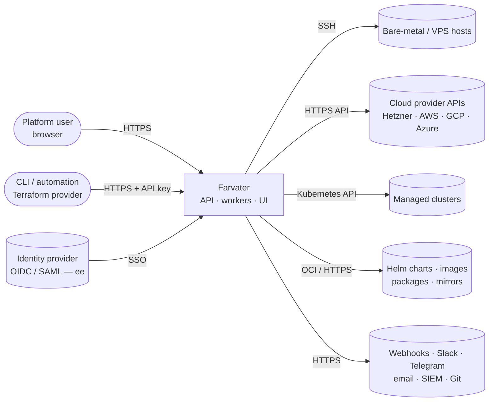
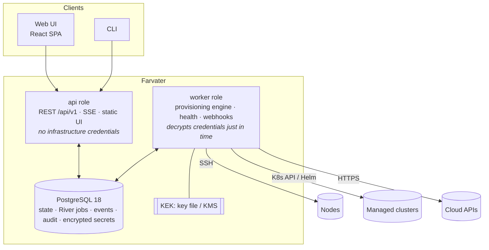
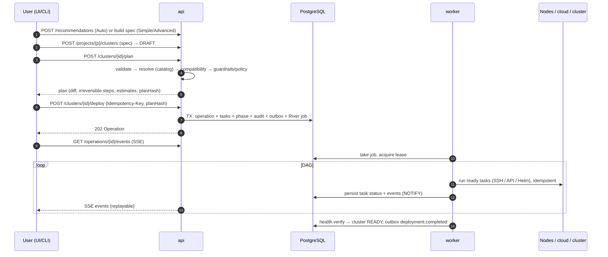

# Architecture

> Status: **Proposed** (Phase 0) — awaiting owner approval. Language: English · [Русский](ARCHITECTURE.ru.md)
>
> This is the hub document. The deep dives are in [`docs/architecture/`](architecture/), the decisions in [DECISIONS](DECISIONS.md) and the [ADRs](architecture/adr/), and the security design in [`docs/security/`](security/).

## 1. What we are building

**Farvater** is a Kubernetes provisioning and lifecycle platform. It takes a user from bare infrastructure (SSH-reachable hosts, later cloud accounts) to a production-ready, observable, backed-up and secure Kubernetes cluster in a few steps, ideally one click. After that it manages the cluster: upgrades, scaling, add-ons, backup/restore, health. It has three modes: **Auto** (answer five questions), **Simple** (pick a preset) and **Advanced** (full control, YAML). It ships in two editions: **Community** (Apache-2.0) and **Enterprise** (governance, SSO, policy, fleet, air-gap). See [PRODUCT](PRODUCT.md).

Priorities for every architectural trade-off, in order (prompt §126): **Reliability → Security → Idempotency → Observability → Maintainability → Extensibility → UX → Performance.**

## 2. System context



## 3. Containers (deployable units)



- **One server binary** with roles `api`, `worker`, `all`, `migrate` (ADR-0003). The web UI is embedded in the binary. The **CLI** is a separate thin binary.
- **PostgreSQL is the only required stateful dependency** (ADR-0006, ADR-0007). It holds domain state, the River job queue, operation events (SSE replay), the audit log and encrypted secrets. Pub/sub uses `LISTEN/NOTIFY`, and locks use advisory locks or lease rows. Valkey is optional for very large HA installations.
- The **api** role never touches customer infrastructure and cannot decrypt credentials. Only **workers** can (see [Security model §2](security/SECURITY_MODEL.md#2-trust-boundaries)).

## 4. Architecture style

**Modular monolith, hexagonal (ports and adapters), plugin-based at the edges.**

```
Delivery        internal/api (HTTP, SSE)            cmd/farvater → pkg/client
                        │
Application     internal/app  — use cases: authz, tenancy, validation, idempotency, audit, transactions, outbox
                        │
Engine          internal/engine — planner → DAG → executor (leases, retries, resume, rollback, events)
                        │                                    │
Domain          internal/domain — entities, ClusterSpec, state machines, typed errors (no I/O)
                        │
Ports/SDK       pkg/sdk (InfrastructureProvider, KubernetesDistribution, Addon, NodeHandle, Task, HealthProbe…)
                        │
Adapters        internal/adapters — postgres (sqlc), queue (River), ssh, nodehelper, helm, kube, kms, httpx
Plugins         plugins/ — providers (simulated, baremetal, hetzner…), distributions (kubeadm, k3s, rke2), add-ons
```

The rules (enforced in CI, see [repository structure §2](architecture/repository-structure.md#2-dependency-rules)):
- The domain and engine never import plugins or adapters (dependency inversion, prompt §99).
- Plugins depend only on `pkg/sdk`.
- `ee/` extends the core through declared extension points. The core never imports `ee/`.

## 5. Modules

| Module | Responsibility | Key doc |
|---|---|---|
| `domain` | Cluster, Node, Operation, Task, Template, Credential…; state machines; errors | [Data model](architecture/data-model.md) |
| `app` | Use cases; enforces authz/tenancy/idempotency/audit; transactional boundaries | [API design](architecture/api-design.md) |
| `engine` | Plan, DAG, executor, retries, resume, rollback, events | [Provisioning engine](architecture/provisioning-engine.md) |
| `api` | REST + SSE, problem+json, rate limits, sessions/CSRF | [API design](architecture/api-design.md) |
| `authn` / `authz` / `tenancy` | Identity, permissions, scopes, RLS session | [Security model](security/SECURITY_MODEL.md) |
| `secrets` | Envelope encryption, key providers, redaction | [Security model §6](security/SECURITY_MODEL.md#6-secrets-management) |
| `catalog` / `compat` / `recommend` | Version catalog, compatibility rules, Auto Mode decision engine, presets | [Auto Mode & catalog](architecture/auto-mode-and-catalog.md) |
| `health` | Health probes, aggregate health, certificate expiry | [Provisioning engine §11](architecture/provisioning-engine.md#11-health-engine) |
| `audit`, `notify`, `webhooks` | Append-only audit, notifications, signed webhooks | [API design §9](architecture/api-design.md#9-webhooks) |
| `entitlements` | Edition features and limits (single place) | ADR-0002 |
| `adapters/*` | PostgreSQL, River, SSH, node helper, Helm, Kubernetes, KMS, safe HTTP | [Core interfaces](architecture/core-interfaces.md) |
| `plugins/*` | Providers, distributions, OS families, add-ons | [Core interfaces](architecture/core-interfaces.md) |
| `web` | React SPA | [UI architecture](architecture/ui-architecture.md) |

## 6. Key flows

### 6.1 Create and deploy a cluster



### 6.2 Failure and resume

On a task failure, retries handle transient errors. When retries are exhausted or the error is permanent, the operation **pauses**. The user gets an explanation (what / why / where / how to fix) and actions: Retry task, Resume, Roll back (reversible tasks), Abort. If a worker crashes, its lease expires and another worker resumes. Idempotent tasks make re-running safe. Details: [provisioning engine §7](architecture/provisioning-engine.md#7-failure-handling-resume-and-rollback).

### 6.3 Upgrade

Upgrade advisor (compatibility, deprecated APIs, etcd guard) → plan → confirmation (or approval, ee) → control plane node by node with an etcd snapshot first → add-ons that must move → workers in drained batches → validation. Kubernetes minors are never skipped. See [Auto Mode & catalog §6](architecture/auto-mode-and-catalog.md#6-upgrade-advisor-prompt-71-229).

## 7. Configuration as code

### ClusterSpec

Everything the UI can do is expressible as a declarative, versioned document (prompt §34). The UI ↔ YAML round-trip is lossless:

```yaml
apiVersion: farvater.io/v1alpha1
kind: Cluster
metadata:
  name: production
  project: payments
spec:
  environment: production
  infrastructure:
    provider: baremetal
    accountRef: dc1
    nodes:
      - { name: cp-1, role: control-plane, address: 10.0.0.11, ssh: { user: ops, credentialRef: dc1-key } }
      - { name: cp-2, role: control-plane, address: 10.0.0.12, ssh: { user: ops, credentialRef: dc1-key } }
      - { name: cp-3, role: control-plane, address: 10.0.0.13, ssh: { user: ops, credentialRef: dc1-key } }
      - { name: w-1,  role: worker,        address: 10.0.0.21, ssh: { user: ops, credentialRef: dc1-key } }
      - { name: w-2,  role: worker,        address: 10.0.0.22, ssh: { user: ops, credentialRef: dc1-key } }
      - { name: w-3,  role: worker,        address: 10.0.0.23, ssh: { user: ops, credentialRef: dc1-key } }
  kubernetes:
    distribution: kubeadm
    version: "1.36"                      # minor → patch resolved from the catalog; or pin "1.36.5"
    controlPlane: { endpoint: { type: kube-vip, address: 10.0.0.10 } }
    containerRuntime: { name: containerd }
    podCIDR: 10.244.0.0/16
    serviceCIDR: 10.96.0.0/12
  networking:
    cni: { provider: cilium, kubeProxyReplacement: true, hubble: true }
    gateway: { provider: cilium }        # Gateway API; cilium | envoy-gateway | nginx-gateway-fabric | traefik
    loadBalancer: { provider: metallb, mode: l2, addressPools: ["10.0.0.200-10.0.0.220"] }
  storage: { provider: longhorn, defaultStorageClass: true, longhorn: { replicaCount: 3 } }
  certificates: { certManager: true, issuer: letsencrypt, acme: { email: ops@example.com, challenge: http01 } }
  observability: { preset: standard }    # none | basic | standard | full
  security: { profile: hardened }
  backup:
    enabled: true
    etcdSnapshots: { schedule: "0 */6 * * *", retention: 28 }
    destination: { type: s3, bucket: prod-backups, credentialRef: s3-backup }
  gitops: { enabled: false }
  addons: [ { name: metrics-server } ]
```

Rules:
- Secrets never appear in a spec, only `credentialRef`s.
- Unknown fields are rejected.
- A JSON Schema is generated from Go types (`pkg/spec`) and used by the API, the UI forms, Monaco and the CLI.
- Every saved change creates an immutable **spec revision**, so history and diffs exist (prompt §97).
- Planning pins everything into a **ResolvedSpec** for reproducibility.

## 8. Extensibility (plugin architecture)

- **Infrastructure providers** (`InfrastructureProvider`): simulated (test only), bare metal / existing infrastructure (SSH), then Hetzner, AWS, GCP, Azure. Capability flags (create instances, LBs, pricing, regions…) drive the engine and the UI.
- **Kubernetes distributions** (`KubernetesDistribution`): kubeadm first, then k3s and RKE2; Talos and k0s are candidates.
- **OS families** (`OSFamily`): debian (Ubuntu, Debian) first, then rhel (Rocky, AlmaLinux).
- **Add-ons** (`Addon` plus capability interfaces `CNI`, `GatewayProvider`, `LoadBalancerProvider`, `StorageProvider`): mostly declarative (`addon.yaml` + values template + JSON Schema) installed by one Helm service. Dependencies are expressed as capabilities (`requires: [cni, default-storage-class]`) and ordered automatically.
- **Version catalog**: data, not code. It is signed and updatable without a release. A compatibility engine and the Auto Mode decision engine run on it.
- **Enterprise extension points**: identity providers, authorizer (custom roles/ABAC), policy evaluator, approval gate, audit sinks, key providers, fleet controller, entitlements.

Details: [Core interfaces](architecture/core-interfaces.md) · [Auto Mode & catalog](architecture/auto-mode-and-catalog.md).

## 9. Technology choices (summary)

| Area | Choice | ADR |
|---|---|---|
| Backend | Go, chi router + Huma v2 (typed operations → committed OpenAPI 3.1, breaking-change gate) | 0003, 0005 |
| Persistence | PostgreSQL 18, pgx v5, sqlc, goose | 0006 |
| Jobs / coordination | River (PostgreSQL), LISTEN/NOTIFY, advisory locks, leases; no Redis requirement | 0007 |
| Engine | Own DAG engine, one job per operation with leases; Temporal rejected for now | 0008 |
| Real-time | SSE with replay | 0009 |
| Plugins | Compile-time Go interfaces + declarative add-ons; embedded Helm SDK | 0010 |
| Tenancy | Org/project scoping + PostgreSQL RLS | 0011 |
| Frontend | React 19, TypeScript 7, Vite 8, Tailwind v4, shadcn/ui (Base UI), TanStack Router/Query, RHF + Zod 4, Monaco, Lingui | 0012 |
| Infra tooling | Native Go providers; no Terraform/Ansible in the core; Cluster API evaluated for clouds in Phase 7 | 0013 |
| Secrets | Envelope encryption (AES-256-GCM), KeyProvider abstraction | 0014 |
| Remote execution | Agentless SSH, typed commands, signed ephemeral node helper | 0015 |
| Networking defaults | Cilium; Gateway API only (platform-owned CRDs; Cilium Gateway or Envoy Gateway); no ingress-nginx | 0020 |
| Kubernetes defaults | Default 1.36, latest 1.37; containerd 2.3 LTS; kubeadm v1beta4 | 0021 |

Full list with versions: [Technology stack](architecture/technology-stack.md) · [DECISIONS](DECISIONS.md).

## 10. Security model (summary)

- **Trust boundaries:** clients → api (no infrastructure credentials) → database (ciphertext only) → workers (just-in-time decryption) → customer infrastructure.
- **Tenancy:** every row scoped by org/project. Authorization in the app layer plus PostgreSQL RLS.
- **Secrets:** envelope encryption with the KEK outside the database. Secrets are write-only in the API, redacted in logs and errors, and never in git.
- **Remote execution:** no shell interpolation of user data, typed argv commands, files rendered from structs over SFTP, mandatory host-key verification.
- **Outbound:** SSRF guard for every user-influenced URL.
- **Audit:** append-only, hash-chained, exportable.
- **Supply chain:** pinned dependencies, SBOM, signatures, provenance, digests for catalog artifacts.

Details: [Security model](security/SECURITY_MODEL.md) · [Threat model](security/THREAT_MODEL.md).

## 11. Deployment model (summary)

`make dev` runs docker compose with PostgreSQL, api, worker and Vite. Small installations use compose or a single binary with `all` plus PostgreSQL. Kubernetes installations use a Helm chart with N api and N worker replicas, a migrate Job and PostgreSQL (managed or CloudNativePG). Enterprise HA spreads api×3 and worker×3 across zones with HA PostgreSQL and KMS. Air-gapped installs use signed offline bundles. Details: [Deployment model](architecture/deployment-model.md).

## 12. Current vs target architecture (prompt §112, step 3)

### Current architecture

The repository was **empty** at the start of Phase 0: no commits, no code, no infrastructure. Phase 0 adds documentation only (this document set) and the Apache-2.0 `LICENSE`. There is nothing to migrate or stay compatible with.

### Target architecture

Everything described above, delivered phase by phase ([ROADMAP](ROADMAP.md)). The MVP (Phases 1–4) has:
- the core platform (auth, tenancy, API, UI, CLI, audit, credentials vault),
- the full provisioning engine,
- the bare-metal provider with kubeadm and Cilium,
- Gateway API, MetalLB, storage, cert-manager, monitoring and logging,
- etcd backups, health, Simple Mode, templates.

Enterprise capabilities are designed now (data model, extension points, entitlements) and built after the MVP gate.

### External dependencies

| Dependency | Used for | Required? | Notes |
|---|---|---|---|
| PostgreSQL ≥ 16 (18 recommended) | All state, queue, events, audit | Yes | `uuidv7()` built in on 18; app-side UUIDv7 on 16–17 |
| Docker / OCI runtime | Running the platform (compose/K8s), CI test nodes | For containerized installs | Single binary also runs without containers |
| Internet or mirrors | Packages (pkgs.k8s.io / dl.k8s.io), charts, images | Yes, or offline bundles | Air-gapped via bundles (ee) |
| KMS / OpenBao / Vault | External KEK | Optional (ee) | Local KEK file by default |
| SMTP, Slack, Telegram | Notifications | Optional | |
| Valkey | Shared rate limiting / cache at large scale | Optional | Not Redis (license) |
| Identity provider | SSO | Optional (ee) | OIDC / SAML |
| Cloud accounts | Cloud providers (Phase 7) and real-VM E2E | Optional | Hetzner suggested for CI |

Main libraries: client-go, Helm SDK v4, golang.org/x/crypto/ssh, pgx, sqlc, River, goose, chi, Huma, Tink, OpenTelemetry. The frontend libraries are listed in the [technology stack](architecture/technology-stack.md).

### Milestones

M1 skeleton (Phase 1) → M2 engine (Phase 2) → M3 first real cluster (Phase 3) → **M4 MVP** (Phase 4) → M5 Auto Mode → M6 lifecycle → M7 Hetzner → enterprise milestones. See [ROADMAP](ROADMAP.md#milestones-and-demos).

## 13. Biggest risks

| # | Risk | Impact | Mitigation |
|---|---|---|---|
| 1 | **Scope vs capacity.** The spec describes years of team work | Never shipping, or shipping shallow features | Strict phase gates, vertical slices, MVP definition, no enterprise work before the MVP gate (§239) |
| 2 | **No real hardware for testing** | Bugs on real hosts (kernels, networks, disks) | Container-node E2E from Phase 3; a capped cloud budget for nightly real-VM E2E before the MVP; honest phase reports |
| 3 | **Ecosystem churn**: 3 Kubernetes minors a year, containerd every 4 months, etcd 3.7, Gateway API v1.5/1.6 changes, ingress-nginx retired | Broken or outdated combinations | Data-driven signed catalog decoupled from releases; automated update PRs with compatibility tests; untested combinations flagged |
| 4 | **Version-skew traps today**: Cilium 1.20 is tested only up to K8s 1.36, Envoy Gateway 1.9 up to 1.36, etcd 3.6 → 3.7 needs ≥ 3.6.11 | Default "latest" yields untested clusters | Default K8s 1.36; 1.37 offered as "latest" with warnings; etcd upgrade guard |
| 5 | **Heterogeneous hosts** (OS variants, Ubuntu 26.04 Rust coreutils/sudo-rs, SELinux, firewalls, MTU, time skew, x86-64-v3 on Rocky 10) | Failed bootstraps | Exhaustive preflight, OSFamily strategies, signed node helper instead of shell pipelines, narrow initial support matrix |
| 6 | **Partial failure of irreversible steps** (kubeadm init, etcd membership) | Stuck or broken clusters | Fine-grained idempotent tasks with `Check`, serialized CP joins, pause-by-default, etcd snapshots before risky steps, recovery runbooks |
| 7 | **Credential custody**: the platform holds root keys and tokens | Catastrophic breach | Envelope encryption, api/worker separation, just-in-time decryption, KMS option, audit, threat model, pentest before enterprise GA |
| 8 | **Multi-tenancy bugs** | Data leak between customers | RLS defense in depth, authz-matrix and tenant-escape tests from Phase 1 |
| 9 | **Licenses of bundled components** (Grafana, Loki, Tempo are AGPL; Vault is BSL; Redis changed license) | Legal exposure of the open-core business | Install upstream artifacts unmodified into user clusters; Apache-2.0 alternatives in the catalog (VictoriaMetrics/VictoriaLogs, OpenBao, Valkey); legal review before enterprise sales |
| 10 | **Competition** (Rancher, Kubespray, KubeOne/KKP, Talos Omni, Spectro Cloud Palette) | Low adoption | Differentiate on one click + Auto Mode explanations, compatibility engine, explainable failures, honest open core |
| 11 | **Gateway API transition costs** (CRD ownership, TLSRoute v1alpha2 → v1 migration, users expecting Ingress) | Upgrade failures and migration friction | Platform-owned CRDs, never downgrade, storage-version migration guard, ingress2gateway-based assistant for imported clusters |
| 12 | **Quality of AI-assisted code at this scale** | Hidden defects | Mandatory tests per DoD, linters and custom analyzers, small reviewed slices, adversarial reviews per phase |

## 14. Document map

| Topic | Document |
|---|---|
| Product vision, users, modes, editions, MVP | [PRODUCT](PRODUCT.md) |
| Phases, milestones, DoD | [ROADMAP](ROADMAP.md) |
| Decision index | [DECISIONS](DECISIONS.md) · [ADRs](architecture/adr/) |
| Repository structure | [repository-structure](architecture/repository-structure.md) |
| Technology stack and version baseline | [technology-stack](architecture/technology-stack.md) |
| Database schema | [data-model](architecture/data-model.md) |
| Core interfaces and plugins | [core-interfaces](architecture/core-interfaces.md) |
| Provisioning engine | [provisioning-engine](architecture/provisioning-engine.md) |
| Auto Mode, catalog, compatibility | [auto-mode-and-catalog](architecture/auto-mode-and-catalog.md) |
| API | [api-design](architecture/api-design.md) |
| UI | [ui-architecture](architecture/ui-architecture.md) |
| Deployment of the platform | [deployment-model](architecture/deployment-model.md) |
| Testing | [testing-strategy](architecture/testing-strategy.md) |
| Security | [SECURITY_MODEL](security/SECURITY_MODEL.md) · [THREAT_MODEL](security/THREAT_MODEL.md) |
