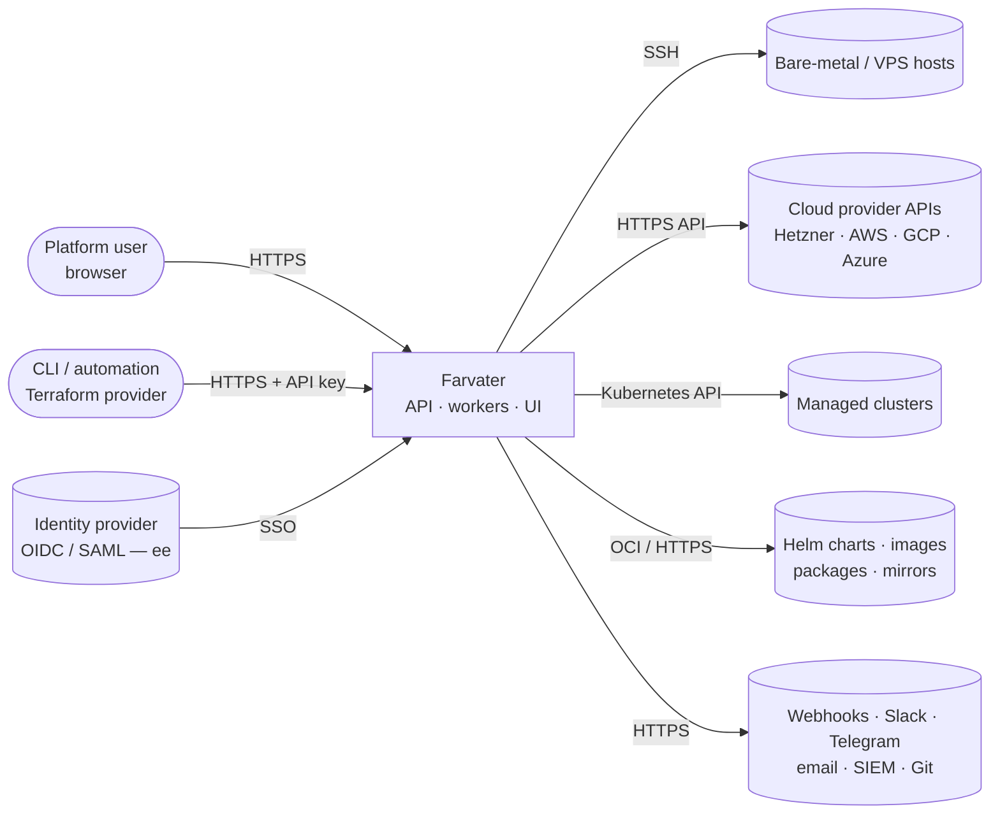
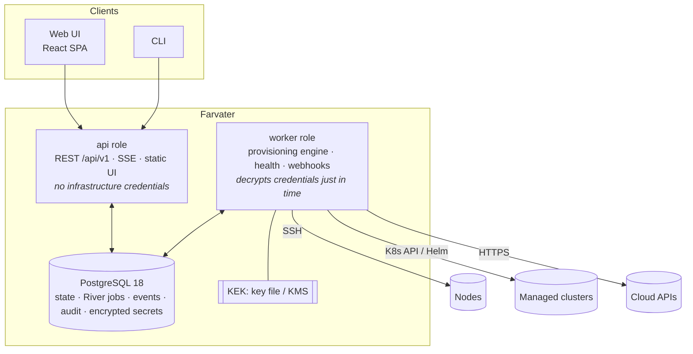
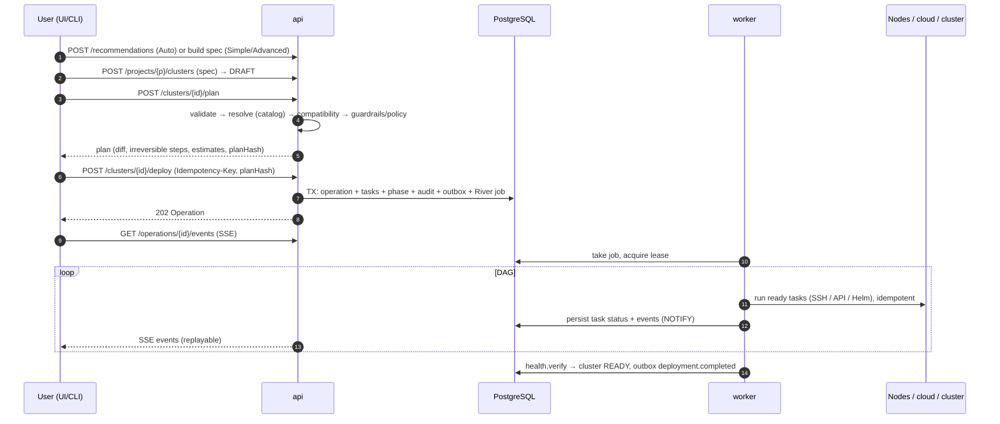

# Архитектура

> Статус: **Предложено** (Phase 0) — ожидает утверждения владельцем. Язык: [English](ARCHITECTURE.md) · Русский
>
> Это центральный документ. Подробные разборы — в [`docs/architecture/`](architecture/), решения — в [DECISIONS](DECISIONS.ru.md) и [ADR](architecture/adr/), проект безопасности — в [`docs/security/`](security/).

## 1. Что мы создаём

**Farvater** — платформа провижининга (provisioning) и управления жизненным циклом Kubernetes. Она проводит пользователя от «голой» инфраструктуры (хостов, доступных по SSH, а позже — облачных аккаунтов) до готового к продакшену, наблюдаемого, защищённого и обеспеченного резервными копиями кластера Kubernetes за несколько шагов, в идеале — в один клик. После этого платформа управляет кластером: обновления (upgrade), масштабирование, аддоны, резервное копирование и восстановление, состояние (health). Режимов три: **Auto** (ответить на пять вопросов), **Simple** (выбрать пресет) и **Advanced** (полный контроль, YAML). Платформа поставляется в двух редакциях: **Community** (Apache-2.0) и **Enterprise** (корпоративное управление, SSO, политики, управление парком кластеров, изолированные установки (air-gap)). См. [PRODUCT](PRODUCT.ru.md).

Приоритеты при любом архитектурном компромиссе, в порядке убывания (промпт §126): **Надёжность → Безопасность → Идемпотентность → Наблюдаемость → Сопровождаемость → Расширяемость → UX → Производительность.**

## 2. Системный контекст



## 3. Контейнеры (развёртываемые единицы)



- **Один серверный бинарник** с ролями `api`, `worker`, `all`, `migrate` (ADR-0003). Веб-интерфейс встроен в бинарник. **CLI** — отдельный тонкий бинарник.
- **PostgreSQL — единственная обязательная зависимость, хранящая состояние** (ADR-0006, ADR-0007). В ней находятся состояние предметной области, очередь заданий River, события операций (для воспроизведения SSE), журнал аудита и зашифрованные секреты. Pub/sub реализован через `LISTEN/NOTIFY`, блокировки — через advisory-блокировки или строки аренды (lease). Для очень крупных HA-инсталляций опционально используется Valkey.
- Роль **api** никогда не обращается к инфраструктуре клиента и не может расшифровывать учётные данные. Это умеют только **воркеры** (см. [Модель безопасности §2](security/SECURITY_MODEL.ru.md)).

## 4. Архитектурный стиль

**Модульный монолит, гексагональная архитектура (порты и адаптеры), плагины на периферии.**

```
Delivery        internal/api (HTTP, SSE)            cmd/farvater → pkg/client
                        │
Application     internal/app  — use cases: authz, tenancy, validation, idempotency, audit, transactions, outbox
                        │
Engine          internal/engine — planner → DAG → executor (leases, retries, resume, rollback, events)
                        │                                    │
Domain          internal/domain — entities, ClusterSpec, state machines, typed errors (no I/O)
                        │
Ports/SDK       pkg/sdk (InfrastructureProvider, KubernetesDistribution, Addon, NodeHandle, Task, HealthProbe…)
                        │
Adapters        internal/adapters — postgres (sqlc), queue (River), ssh, nodehelper, helm, kube, kms, httpx
Plugins         plugins/ — providers (simulated, baremetal, hetzner…), distributions (kubeadm, k3s, rke2), add-ons
```

Правила (проверяются в CI, см. [структура репозитория §2](architecture/repository-structure.ru.md)):
- Домен и движок никогда не импортируют плагины или адаптеры (инверсия зависимостей, промпт §99).
- Плагины зависят только от `pkg/sdk`.
- `ee/` расширяет ядро через объявленные точки расширения. Ядро никогда не импортирует `ee/`.

## 5. Модули

| Модуль | Ответственность | Ключевой документ |
|---|---|---|
| `domain` | Cluster, Node, Operation, Task, Template, Credential…; конечные автоматы; ошибки | [Модель данных](architecture/data-model.ru.md) |
| `app` | Сценарии использования (use cases); обеспечение authz/тенантности/идемпотентности/аудита; границы транзакций | [Проектирование API](architecture/api-design.ru.md) |
| `engine` | План, DAG (граф задач), исполнитель, повторы, возобновление, откат, события | [Движок провижининга](architecture/provisioning-engine.ru.md) |
| `api` | REST + SSE, problem+json, ограничение частоты запросов (rate limits), сессии/CSRF | [Проектирование API](architecture/api-design.ru.md) |
| `authn` / `authz` / `tenancy` | Идентификация, разрешения, области действия (scopes), сессия RLS | [Модель безопасности](security/SECURITY_MODEL.ru.md) |
| `secrets` | Конвертное шифрование (envelope encryption), провайдеры ключей, маскирование (redaction) | [Модель безопасности §6](security/SECURITY_MODEL.ru.md) |
| `catalog` / `compat` / `recommend` | Каталог версий, правила совместимости, движок принятия решений режима Auto (Auto Mode), пресеты | [Режим Auto и каталог](architecture/auto-mode-and-catalog.ru.md) |
| `health` | Проверки состояния (health probes), агрегированное состояние, истечение срока действия сертификатов | [Движок провижининга §11](architecture/provisioning-engine.ru.md) |
| `audit`, `notify`, `webhooks` | Аудит только на добавление (append-only), уведомления, подписанные вебхуки | [Проектирование API §9](architecture/api-design.ru.md) |
| `entitlements` | Функции и лимиты редакций (в одном месте) | ADR-0002 |
| `adapters/*` | PostgreSQL, River, SSH, node helper, Helm, Kubernetes, KMS, безопасный HTTP | [Базовые интерфейсы](architecture/core-interfaces.ru.md) |
| `plugins/*` | Провайдеры, дистрибутивы, семейства ОС, аддоны | [Базовые интерфейсы](architecture/core-interfaces.ru.md) |
| `web` | React SPA | [Архитектура UI](architecture/ui-architecture.ru.md) |

## 6. Ключевые сценарии

### 6.1 Создание и развёртывание кластера



### 6.2 Сбой и возобновление

При сбое задачи временные ошибки обрабатываются повторами. Если повторы исчерпаны или ошибка постоянная, операция **приостанавливается**. Пользователь получает объяснение (что / почему / где / как исправить) и варианты действий: повторить задачу (Retry task), возобновить (Resume), откатить (Roll back; для обратимых задач), прервать (Abort). Если воркер падает, его аренда истекает, и работу возобновляет другой воркер. Благодаря идемпотентности задач повторный запуск безопасен. Подробнее: [движок провижининга §7](architecture/provisioning-engine.ru.md).

### 6.3 Обновление

Советник по обновлению (upgrade advisor: совместимость, устаревшие API, защита etcd) → план → подтверждение (или согласование, ee) → узлы control plane по одному, предварительно со снимком etcd → аддоны, которые необходимо обновить → рабочие узлы партиями с предварительным drain → проверка. Минорные версии Kubernetes никогда не пропускаются. См. [Режим Auto и каталог §6](architecture/auto-mode-and-catalog.ru.md).

## 7. Конфигурация как код

### ClusterSpec

Всё, что можно сделать в UI, выражается декларативным версионируемым документом (промпт §34). Преобразование UI ↔ YAML в обе стороны выполняется без потерь:

```yaml
apiVersion: farvater.io/v1alpha1
kind: Cluster
metadata:
  name: production
  project: payments
spec:
  environment: production
  infrastructure:
    provider: baremetal
    accountRef: dc1
    nodes:
      - { name: cp-1, role: control-plane, address: 10.0.0.11, ssh: { user: ops, credentialRef: dc1-key } }
      - { name: cp-2, role: control-plane, address: 10.0.0.12, ssh: { user: ops, credentialRef: dc1-key } }
      - { name: cp-3, role: control-plane, address: 10.0.0.13, ssh: { user: ops, credentialRef: dc1-key } }
      - { name: w-1,  role: worker,        address: 10.0.0.21, ssh: { user: ops, credentialRef: dc1-key } }
      - { name: w-2,  role: worker,        address: 10.0.0.22, ssh: { user: ops, credentialRef: dc1-key } }
      - { name: w-3,  role: worker,        address: 10.0.0.23, ssh: { user: ops, credentialRef: dc1-key } }
  kubernetes:
    distribution: kubeadm
    version: "1.36"                      # minor → patch resolved from the catalog; or pin "1.36.5"
    controlPlane: { endpoint: { type: kube-vip, address: 10.0.0.10 } }
    containerRuntime: { name: containerd }
    podCIDR: 10.244.0.0/16
    serviceCIDR: 10.96.0.0/12
  networking:
    cni: { provider: cilium, kubeProxyReplacement: true, hubble: true }
    gateway: { provider: cilium }        # Gateway API; cilium | envoy-gateway | nginx-gateway-fabric | traefik
    loadBalancer: { provider: metallb, mode: l2, addressPools: ["10.0.0.200-10.0.0.220"] }
  storage: { provider: longhorn, defaultStorageClass: true, longhorn: { replicaCount: 3 } }
  certificates: { certManager: true, issuer: letsencrypt, acme: { email: ops@example.com, challenge: http01 } }
  observability: { preset: standard }    # none | basic | standard | full
  security: { profile: hardened }
  backup:
    enabled: true
    etcdSnapshots: { schedule: "0 */6 * * *", retention: 28 }
    destination: { type: s3, bucket: prod-backups, credentialRef: s3-backup }
  gitops: { enabled: false }
  addons: [ { name: metrics-server } ]
```

Правила:
- Секреты никогда не попадают в спецификацию — только ссылки `credentialRef`.
- Неизвестные поля отклоняются.
- JSON Schema генерируется из типов Go (`pkg/spec`) и используется API, формами UI, Monaco и CLI.
- Каждое сохранённое изменение создаёт неизменяемую **ревизию спецификации** (spec revision), поэтому доступны история и сравнение версий (промпт §97).
- При планировании всё фиксируется в **ResolvedSpec** для воспроизводимости.

## 8. Расширяемость (архитектура плагинов)

- **Провайдеры инфраструктуры** (`InfrastructureProvider`): simulated (только для тестов), bare metal / существующая инфраструктура (SSH), затем Hetzner, AWS, GCP, Azure. Флаги возможностей (создание инстансов, балансировщиков нагрузки, цены, регионы…) определяют поведение движка и UI.
- **Дистрибутивы Kubernetes** (`KubernetesDistribution`): сначала kubeadm, затем k3s и RKE2; Talos и k0s — кандидаты.
- **Семейства ОС** (`OSFamily`): сначала debian (Ubuntu, Debian), затем rhel (Rocky, AlmaLinux).
- **Аддоны** (`Addon` плюс интерфейсы возможностей `CNI`, `GatewayProvider`, `LoadBalancerProvider`, `StorageProvider`): в основном декларативные (`addon.yaml` + шаблон values + JSON Schema), устанавливаются единым Helm-сервисом. Зависимости выражаются через возможности (`requires: [cni, default-storage-class]`) и упорядочиваются автоматически.
- **Каталог версий**: данные, а не код. Он подписан и обновляется без выпуска релиза. На нём работают движок совместимости и движок принятия решений режима Auto.
- **Точки расширения Enterprise**: провайдеры идентификации, авторизатор (пользовательские роли/ABAC), вычислитель политик, шлюз согласования (approval gate), приёмники аудита (audit sinks), провайдеры ключей, контроллер парка кластеров (fleet), entitlements.

Подробнее: [Базовые интерфейсы](architecture/core-interfaces.ru.md) · [Режим Auto и каталог](architecture/auto-mode-and-catalog.ru.md).

## 9. Выбор технологий (кратко)

| Область | Выбор | ADR |
|---|---|---|
| Бэкенд | Go, роутер chi, кодогенерация по спецификации OpenAPI 3.1 (spec-first) | 0003, 0005 |
| Хранение данных | PostgreSQL 18, pgx v5, sqlc, goose | 0006 |
| Задания / координация | River (PostgreSQL), LISTEN/NOTIFY, advisory-блокировки, аренды; Redis не требуется | 0007 |
| Движок | Собственный DAG-движок, одно задание на операцию с арендами; Temporal пока отклонён | 0008 |
| Реальное время | SSE с воспроизведением (replay) | 0009 |
| Плагины | Go-интерфейсы, подключаемые на этапе компиляции, + декларативные аддоны; встроенный Helm SDK | 0010 |
| Тенантность | Разграничение по организации/проекту + PostgreSQL RLS | 0011 |
| Фронтенд | React, TypeScript, Vite, Tailwind v4, shadcn/ui, TanStack Router/Query, RHF + Zod, Monaco, i18next | 0012 |
| Инфраструктурные инструменты | Нативные Go-провайдеры; без Terraform/Ansible в ядре; Cluster API рассматривается для облаков в фазе 7 | 0013 |
| Секреты | Конвертное шифрование (AES-256-GCM), абстракция KeyProvider | 0014 |
| Удалённое выполнение | SSH без агентов, типизированные команды, подписанный эфемерный node helper | 0015 |
| Сеть по умолчанию | Cilium; только Gateway API (CRD под управлением платформы; Cilium Gateway или Envoy Gateway); без ingress-nginx | 0020 |
| Kubernetes по умолчанию | По умолчанию 1.36, последняя — 1.37; containerd 2.3 LTS; kubeadm v1beta4 | 0021 |

Полный список с версиями: [Технологический стек](architecture/technology-stack.ru.md) · [DECISIONS](DECISIONS.ru.md).

## 10. Модель безопасности (кратко)

- **Границы доверия:** клиенты → api (без учётных данных инфраструктуры) → база данных (только шифротекст) → воркеры (расшифровка just-in-time, непосредственно перед использованием) → инфраструктура клиента.
- **Тенантность:** каждая строка привязана к организации/проекту. Авторизация на уровне приложения плюс PostgreSQL RLS.
- **Секреты:** конвертное шифрование, KEK хранится вне базы данных. В API секреты доступны только на запись, в логах и ошибках маскируются и никогда не попадают в git.
- **Удалённое выполнение:** никакой подстановки пользовательских данных в shell, типизированные команды в виде argv, файлы формируются из структур и передаются по SFTP, обязательная проверка ключа хоста.
- **Исходящие запросы:** защита от SSRF для каждого URL, на который может повлиять пользователь.
- **Аудит:** только добавление (append-only), цепочка хешей, возможность экспорта.
- **Цепочка поставок:** закреплённые версии зависимостей, SBOM, подписи, provenance, дайджесты для артефактов каталога.

Подробнее: [Модель безопасности](security/SECURITY_MODEL.ru.md) · [Модель угроз](security/THREAT_MODEL.ru.md).

## 11. Модель развёртывания (кратко)

`make dev` запускает docker compose с PostgreSQL, api, worker и Vite. Небольшие инсталляции используют compose или один бинарник с ролью `all` плюс PostgreSQL. Инсталляции в Kubernetes используют Helm-чарт с N репликами api и N репликами worker, Job для миграций (migrate) и PostgreSQL (управляемый или CloudNativePG). В Enterprise HA api×3 и worker×3 распределяются по зонам, с HA PostgreSQL и KMS. Изолированные (air-gapped) установки используют подписанные офлайн-бандлы. Подробнее: [Модель развёртывания](architecture/deployment-model.ru.md).

## 12. Текущая и целевая архитектура (промпт §112, шаг 3)

### Текущая архитектура

На начало фазы 0 репозиторий был **пустым**: ни коммитов, ни кода, ни инфраструктуры. Фаза 0 добавляет только документацию (этот набор документов) и файл `LICENSE` с лицензией Apache-2.0. Мигрировать или сохранять совместимость не с чем.

### Целевая архитектура

Всё описанное выше, реализуемое пофазно ([ROADMAP](ROADMAP.ru.md)). MVP (фазы 1–4) включает:
- базовую платформу (аутентификация, тенантность, API, UI, CLI, аудит, хранилище учётных данных),
- полный движок провижининга,
- провайдер bare metal с kubeadm и Cilium,
- Gateway API, MetalLB, хранилище, cert-manager, мониторинг и логирование,
- резервные копии etcd, проверку состояния (health), режим Simple (Simple Mode), шаблоны.

Возможности Enterprise проектируются уже сейчас (модель данных, точки расширения, entitlements), а реализуются после контрольной точки MVP.

### Внешние зависимости

| Зависимость | Назначение | Обязательна? | Примечания |
|---|---|---|---|
| PostgreSQL ≥ 17 (рекомендуется 18) | Всё состояние, очередь, события, аудит | Да | В версии 18 `uuidv7()` встроена |
| Docker / OCI-среда выполнения | Запуск платформы (compose/K8s), тестовые узлы в CI | Для контейнерных установок | Один бинарник работает и без контейнеров |
| Интернет или зеркала | Пакеты (pkgs.k8s.io / dl.k8s.io), чарты, образы | Да, либо офлайн-бандлы | Изолированные установки — через бандлы (ee) |
| KMS / OpenBao / Vault | Внешний KEK | Опционально (ee) | По умолчанию — локальный файл KEK |
| SMTP, Slack, Telegram | Уведомления | Опционально | |
| Valkey | Общее ограничение частоты запросов / кеш при большом масштабе | Опционально | Не Redis (из-за лицензии) |
| Провайдер идентификации | SSO | Опционально (ee) | OIDC / SAML |
| Облачные аккаунты | Облачные провайдеры (фаза 7) и E2E на реальных ВМ | Опционально | Для CI предлагается Hetzner |

Основные библиотеки: client-go, Helm SDK, golang.org/x/crypto/ssh, pgx, sqlc, River, goose, chi, OpenTelemetry. Библиотеки фронтенда перечислены в [технологическом стеке](architecture/technology-stack.ru.md).

### Вехи

M1 каркас (фаза 1) → M2 движок (фаза 2) → M3 первый реальный кластер (фаза 3) → **M4 MVP** (фаза 4) → M5 режим Auto → M6 жизненный цикл → M7 Hetzner → вехи Enterprise. См. [ROADMAP](ROADMAP.ru.md).

## 13. Главные риски

| # | Риск | Последствия | Меры снижения |
|---|---|---|---|
| 1 | **Объём работ против ресурсов.** Спецификация описывает годы работы целой команды | Продукт так и не выходит или выходит с поверхностной функциональностью | Строгие контрольные точки фаз, вертикальные срезы, чёткое определение MVP, никакой работы над Enterprise до контрольной точки MVP (§239) |
| 2 | **Нет реального оборудования для тестирования** | Ошибки на реальных хостах (ядра, сети, диски) | E2E на контейнерных узлах с фазы 3; ограниченный облачный бюджет на ночные E2E на реальных ВМ до MVP; честные отчёты по фазам |
| 3 | **Быстрые изменения экосистемы**: 3 минорных релиза Kubernetes в год, containerd каждые 4 месяца, etcd 3.7, изменения в Gateway API v1.5/1.6, ingress-nginx выведен из эксплуатации | Сломанные или устаревшие комбинации | Подписанный каталог на основе данных, не привязанный к релизам; автоматические PR с обновлениями и тестами совместимости; непроверенные комбинации помечаются |
| 4 | **Ловушки рассогласования версий уже сегодня**: Cilium 1.20 протестирован только до K8s 1.36, Envoy Gateway 1.9 — до 1.36, переход etcd 3.6 → 3.7 требует ≥ 3.6.11 | Выбор «последней» версии по умолчанию даёт непротестированные кластеры | По умолчанию K8s 1.36; 1.37 предлагается как «последняя» с предупреждениями; защита при обновлении etcd |
| 5 | **Неоднородные хосты** (варианты ОС, Rust coreutils/sudo-rs в Ubuntu 26.04, SELinux, файрволы, MTU, расхождение времени, x86-64-v3 в Rocky 10) | Сбои начальной установки (bootstrap) | Исчерпывающие предварительные проверки (preflight), стратегии OSFamily, подписанный node helper вместо shell-конвейеров, узкая начальная матрица поддержки |
| 6 | **Частичный сбой необратимых шагов** (kubeadm init, членство в etcd) | Зависшие или сломанные кластеры | Мелкие идемпотентные задачи с `Check`, последовательное присоединение узлов control plane, приостановка по умолчанию, снимки etcd перед рискованными шагами, runbook-и по восстановлению |
| 7 | **Хранение учётных данных**: платформа держит root-ключи и токены | Катастрофическая утечка | Конвертное шифрование, разделение api/worker, расшифровка just-in-time, вариант с KMS, аудит, модель угроз, пентест до GA Enterprise |
| 8 | **Ошибки мультитенантности** | Утечка данных между клиентами | RLS как эшелонированная защита, тесты матрицы авторизации и выхода за пределы тенанта с фазы 1 |
| 9 | **Лицензии поставляемых компонентов** (Grafana, Loki, Tempo — AGPL; Vault — BSL; Redis сменил лицензию) | Юридические риски для open-core-бизнеса | Установка upstream-артефактов в пользовательские кластеры без модификаций; альтернативы под Apache-2.0 в каталоге (VictoriaMetrics/VictoriaLogs, OpenBao, Valkey); юридическая экспертиза до начала продаж Enterprise |
| 10 | **Конкуренция** (Rancher, Kubespray, KubeOne/KKP, Talos Omni, Spectro Cloud Palette) | Слабое распространение | Отличия: один клик + объяснения в режиме Auto, движок совместимости, объяснимые сбои, честный open core |
| 11 | **Издержки перехода на Gateway API** (владение CRD, миграция TLSRoute v1alpha2 → v1, пользователи ожидают Ingress) | Сбои обновлений и сложности миграции | CRD под управлением платформы, никаких понижений версии, защита миграции storage version, помощник на основе ingress2gateway для импортированных кластеров |
| 12 | **Качество кода, написанного с помощью ИИ, при таком масштабе** | Скрытые дефекты | Обязательные тесты согласно DoD, линтеры и собственные анализаторы, небольшие проверенные срезы, состязательные ревью в каждой фазе |

## 14. Карта документов

| Тема | Документ |
|---|---|
| Видение продукта, пользователи, режимы, редакции, MVP | [PRODUCT](PRODUCT.ru.md) |
| Фазы, вехи, DoD | [ROADMAP](ROADMAP.ru.md) |
| Индекс решений | [DECISIONS](DECISIONS.ru.md) · [ADR](architecture/adr/) |
| Структура репозитория | [repository-structure](architecture/repository-structure.ru.md) |
| Технологический стек и базовый набор версий | [technology-stack](architecture/technology-stack.ru.md) |
| Схема базы данных | [data-model](architecture/data-model.ru.md) |
| Базовые интерфейсы и плагины | [core-interfaces](architecture/core-interfaces.ru.md) |
| Движок провижининга | [provisioning-engine](architecture/provisioning-engine.ru.md) |
| Режим Auto, каталог, совместимость | [auto-mode-and-catalog](architecture/auto-mode-and-catalog.ru.md) |
| API | [api-design](architecture/api-design.ru.md) |
| UI | [ui-architecture](architecture/ui-architecture.ru.md) |
| Развёртывание платформы | [deployment-model](architecture/deployment-model.ru.md) |
| Тестирование | [testing-strategy](architecture/testing-strategy.ru.md) |
| Безопасность | [SECURITY_MODEL](security/SECURITY_MODEL.ru.md) · [THREAT_MODEL](security/THREAT_MODEL.ru.md) |
