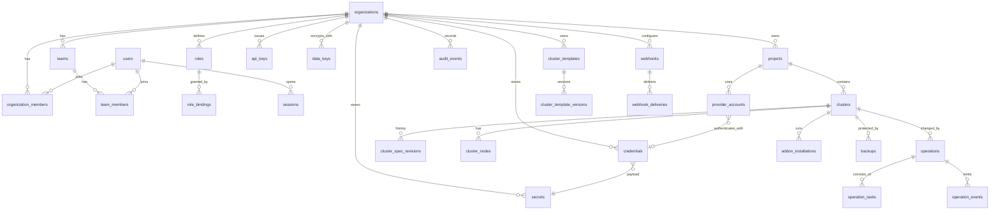

# Data model and database schema

> Status: **Proposed** (Phase 0). Language: English · [Русский](data-model.ru.md)
>
> Related: [ARCHITECTURE](../ARCHITECTURE.md) · [Provisioning engine](provisioning-engine.md) · [Security model](../security/SECURITY_MODEL.md) · ADR-0006 (PostgreSQL, sqlc, goose) · ADR-0011 (multi-tenancy and RLS)

This document defines the persistent model of the platform: entities, their ownership, the PostgreSQL schema (as a DDL sketch), indexes, tenant isolation, retention and migration rules. The DDL is a design artefact. The real migrations are written in Phase 1 and can differ in details, but not in the rules from section 1.

## 1. Conventions

| Rule | Decision | Why |
|---|---|---|
| Database | PostgreSQL 18 recommended (minimum 16; 14 and 15 reach EOL in Nov 2026 / Nov 2027) | `uuidv7()` built in since 18; mature JSONB, RLS, partitioning, `LISTEN/NOTIFY` |
| Primary keys | `uuid`, generated as UUIDv7 | Globally unique ids in API URLs; time-ordered, so B-tree indexes stay compact. The DDL sketch uses PG 18's `DEFAULT uuidv7()`; on PG 16–17 the migrations omit the default and the application supplies the id |
| Time | `timestamptz`, UTC, columns `created_at`, `updated_at` | No local-time ambiguity |
| Enumerations | `text` + `CHECK` constraint (not PG `ENUM`) | Adding a value is an ordinary migration without the `ALTER TYPE` limitations |
| Optimistic locking | `version bigint NOT NULL DEFAULT 0` on mutable aggregates | Lost-update protection. The API exposes it as `ETag` / `If-Match` |
| Tenancy | Every tenant-owned row has `org_id`; project-scoped rows also have `project_id` | Server-side isolation plus RLS (section 4) |
| Deletion | Hard delete by default. Soft delete (`deleted_at`) only for `clusters` and `projects` | Audit, operation history and billing must keep resolving the ids |
| Specs and free-form data | `jsonb` with a schema version (`spec_schema`) | ClusterSpec evolves under `apiVersion`; validated in the app with JSON Schema |
| Secrets | Never in plain columns. Only in `secrets.ciphertext` (envelope-encrypted) | See [Security model](../security/SECURITY_MODEL.md) |
| Naming | `snake_case`, plural table names, FK columns `<entity>_id` | Conventional, sqlc-friendly |
| Queries | Hand-written SQL compiled by **sqlc** (pgx v5) | Type safety without an ORM. Every query is visible in review |
| Migrations | **goose**, SQL files, `-- +goose Up/Down`, embedded in the binary | Versioned and reversible where possible. Run by `server migrate` under an advisory lock |

The job queue (**River**) owns its own tables (`river_job`, `river_leader`, `river_queue`, …). River creates them with its own versioned migrations, which goose runs as one migration step. We never write to River tables directly. We only enqueue jobs through River's API in the same transaction as our domain rows.

## 2. Entity overview



Ownership chain: **Organization → Project → Cluster → (nodes, operations, add-on installations, backups)**. The Community edition creates one default organization and project during setup but uses the same schema. Enterprise features (many organizations, teams, policies, approvals) need no schema redesign.

## 3. Schema (DDL sketch)

### 3.1 Identity and tenancy

```sql
CREATE TABLE organizations (
  id          uuid PRIMARY KEY DEFAULT uuidv7(),
  slug        text NOT NULL UNIQUE CHECK (slug ~ '^[a-z0-9]([a-z0-9-]{0,61}[a-z0-9])?$'),
  name        text NOT NULL,
  settings    jsonb NOT NULL DEFAULT '{}',          -- non-secret org settings (default region, retention, …)
  created_at  timestamptz NOT NULL DEFAULT now(),
  updated_at  timestamptz NOT NULL DEFAULT now(),
  version     bigint NOT NULL DEFAULT 0
);

CREATE TABLE users (
  id               uuid PRIMARY KEY DEFAULT uuidv7(),
  email            citext NOT NULL UNIQUE,
  display_name     text NOT NULL,
  password_hash    text,                             -- argon2id PHC string; NULL for SSO-only users
  status           text NOT NULL DEFAULT 'active' CHECK (status IN ('active','disabled','pending')),
  locale           text NOT NULL DEFAULT 'en' CHECK (locale IN ('en','ru')),
  mfa_required     boolean NOT NULL DEFAULT false,   -- Phase 9 (TOTP / WebAuthn tables added then)
  last_login_at    timestamptz,
  created_at       timestamptz NOT NULL DEFAULT now(),
  updated_at       timestamptz NOT NULL DEFAULT now(),
  version          bigint NOT NULL DEFAULT 0
);
-- users are global (one person can belong to several organizations); membership is tenant-scoped:

CREATE TABLE organization_members (
  org_id      uuid NOT NULL REFERENCES organizations(id) ON DELETE CASCADE,
  user_id     uuid NOT NULL REFERENCES users(id) ON DELETE CASCADE,
  created_at  timestamptz NOT NULL DEFAULT now(),
  PRIMARY KEY (org_id, user_id)
);

CREATE TABLE teams (                                 -- used by RBAC from Phase 1, managed in UI from Phase 9
  id          uuid PRIMARY KEY DEFAULT uuidv7(),
  org_id      uuid NOT NULL REFERENCES organizations(id) ON DELETE CASCADE,
  slug        text NOT NULL,
  name        text NOT NULL,
  created_at  timestamptz NOT NULL DEFAULT now(),
  UNIQUE (org_id, slug)
);

CREATE TABLE team_members (
  org_id      uuid NOT NULL,
  team_id     uuid NOT NULL REFERENCES teams(id) ON DELETE CASCADE,
  user_id     uuid NOT NULL REFERENCES users(id) ON DELETE CASCADE,
  PRIMARY KEY (team_id, user_id)
);

CREATE TABLE projects (
  id           uuid PRIMARY KEY DEFAULT uuidv7(),
  org_id       uuid NOT NULL REFERENCES organizations(id) ON DELETE RESTRICT,
  slug         text NOT NULL,
  name         text NOT NULL,
  description  text NOT NULL DEFAULT '',
  labels       jsonb NOT NULL DEFAULT '{}',          -- e.g. cost-center, team ownership (cost allocation later)
  created_at   timestamptz NOT NULL DEFAULT now(),
  updated_at   timestamptz NOT NULL DEFAULT now(),
  deleted_at   timestamptz,
  version      bigint NOT NULL DEFAULT 0
);
CREATE UNIQUE INDEX projects_org_slug_uq ON projects (org_id, slug) WHERE deleted_at IS NULL;
```

### 3.2 Access control

```sql
CREATE TABLE roles (
  id           uuid PRIMARY KEY DEFAULT uuidv7(),
  org_id       uuid REFERENCES organizations(id) ON DELETE CASCADE,  -- NULL = built-in role (global, read-only)
  key          text NOT NULL,                       -- 'owner','admin','operator','developer','viewer' or custom key
  name         text NOT NULL,
  description  text NOT NULL DEFAULT '',
  permissions  text[] NOT NULL,                     -- e.g. {'cluster:read','cluster:scale','node:drain'}
  built_in     boolean NOT NULL DEFAULT false,
  created_at   timestamptz NOT NULL DEFAULT now(),
  updated_at   timestamptz NOT NULL DEFAULT now(),
  UNIQUE NULLS NOT DISTINCT (org_id, key)
);

CREATE TABLE role_bindings (
  id            uuid PRIMARY KEY DEFAULT uuidv7(),
  org_id        uuid NOT NULL REFERENCES organizations(id) ON DELETE CASCADE,
  role_id       uuid NOT NULL REFERENCES roles(id) ON DELETE RESTRICT,
  subject_type  text NOT NULL CHECK (subject_type IN ('user','team','service_account','api_key')),
  subject_id    uuid NOT NULL,
  scope_type    text NOT NULL CHECK (scope_type IN ('organization','project','cluster')),
  scope_id      uuid NOT NULL,                      -- org id, project id or cluster id
  created_by    uuid,
  created_at    timestamptz NOT NULL DEFAULT now(),
  UNIQUE (role_id, subject_type, subject_id, scope_type, scope_id)
);
CREATE INDEX role_bindings_subject_idx ON role_bindings (subject_type, subject_id);

CREATE TABLE sessions (
  id              uuid PRIMARY KEY DEFAULT uuidv7(),
  user_id         uuid NOT NULL REFERENCES users(id) ON DELETE CASCADE,
  token_hash      bytea NOT NULL UNIQUE,            -- SHA-256 of the random session token; token itself only in cookie
  csrf_secret     bytea NOT NULL,
  ip              inet,
  user_agent      text,
  created_at      timestamptz NOT NULL DEFAULT now(),
  last_seen_at    timestamptz NOT NULL DEFAULT now(),
  idle_expires_at timestamptz NOT NULL,
  expires_at      timestamptz NOT NULL,             -- absolute lifetime
  revoked_at      timestamptz
);
CREATE INDEX sessions_user_active_idx ON sessions (user_id) WHERE revoked_at IS NULL;

CREATE TABLE api_keys (
  id            uuid PRIMARY KEY DEFAULT uuidv7(),
  org_id        uuid NOT NULL REFERENCES organizations(id) ON DELETE CASCADE,
  owner_type    text NOT NULL CHECK (owner_type IN ('user','service_account')),
  owner_id      uuid NOT NULL,
  name          text NOT NULL,
  prefix        text NOT NULL UNIQUE,               -- public lookup part, e.g. 'pk_live_3f9a…' (first 12 chars)
  secret_hash   bytea NOT NULL,                     -- SHA-256(HMAC pepper, secret); secret shown once at creation
  permissions   text[] NOT NULL,                    -- must be a subset of the owner's permissions at use time
  expires_at    timestamptz,
  last_used_at  timestamptz,
  last_used_ip  inet,
  revoked_at    timestamptz,
  created_at    timestamptz NOT NULL DEFAULT now()
);

-- Phase 9: service_accounts, mfa_factors (totp/webauthn), identity_providers, scim_* tables.
```

Permission strings follow `resource:verb` (for example `cluster:create`, `cluster:upgrade`, `node:drain`, `credentials:rotate`, `audit:read`). The catalogue of permissions lives in code (`internal/authz`). Each permission has a description and its default roles. The DB stores only the role-to-permission assignments.

### 3.3 Secrets and credentials

```sql
CREATE TABLE data_keys (                             -- per-org data-encryption keys (DEK), stored wrapped by a KEK
  id            uuid PRIMARY KEY DEFAULT uuidv7(),
  org_id        uuid NOT NULL REFERENCES organizations(id) ON DELETE CASCADE,
  wrapped_key   bytea NOT NULL,                     -- DEK encrypted by the key provider (local KEK, OpenBao/Vault Transit, cloud KMS)
  kek_provider  text NOT NULL,                      -- 'local','openbao-transit','aws-kms',…
  kek_key_id    text NOT NULL,                      -- provider key id / version
  algorithm     text NOT NULL DEFAULT 'AES-256-GCM',
  status        text NOT NULL DEFAULT 'active' CHECK (status IN ('active','decrypt-only','destroyed')),
  created_at    timestamptz NOT NULL DEFAULT now(),
  rotated_at    timestamptz
);
CREATE UNIQUE INDEX data_keys_one_active_per_org ON data_keys (org_id) WHERE status = 'active';

CREATE TABLE secrets (
  id           uuid PRIMARY KEY DEFAULT uuidv7(),
  org_id       uuid NOT NULL REFERENCES organizations(id) ON DELETE CASCADE,
  data_key_id  uuid NOT NULL REFERENCES data_keys(id),
  purpose      text NOT NULL,                       -- 'credential','kubeconfig','join-token','webhook-signing','ca-key',…
  nonce        bytea NOT NULL,                      -- 96-bit GCM nonce, unique per encryption
  ciphertext   bytea NOT NULL,                      -- AES-256-GCM(payload), AAD = org_id || id || purpose
  backend      text NOT NULL DEFAULT 'internal' CHECK (backend IN ('internal','openbao','vault','aws-sm','gcp-sm','azure-kv')),
  external_ref text,                                -- when backend != 'internal', path/ARN; ciphertext then empty
  created_at   timestamptz NOT NULL DEFAULT now(),
  updated_at   timestamptz NOT NULL DEFAULT now()
);

CREATE TABLE credentials (
  id             uuid PRIMARY KEY DEFAULT uuidv7(),
  org_id         uuid NOT NULL REFERENCES organizations(id) ON DELETE CASCADE,
  project_id     uuid REFERENCES projects(id),     -- NULL = org-wide credential
  name           text NOT NULL,
  type           text NOT NULL CHECK (type IN ('ssh_private_key','ssh_password','hcloud_token','aws','gcp','azure',
                                                's3','git','registry','smtp','webhook','kubeconfig','openbao','generic')),
  metadata       jsonb NOT NULL DEFAULT '{}',       -- NON-secret: username, public key fingerprint, endpoint, region …
  secret_id      uuid NOT NULL REFERENCES secrets(id) ON DELETE RESTRICT,
  owner_type     text NOT NULL CHECK (owner_type IN ('user','team','service_account','organization')),
  owner_id       uuid NOT NULL,
  expires_at     timestamptz,
  last_used_at   timestamptz,
  rotated_at     timestamptz,
  next_rotation_at timestamptz,
  created_by     uuid,
  created_at     timestamptz NOT NULL DEFAULT now(),
  updated_at     timestamptz NOT NULL DEFAULT now(),
  version        bigint NOT NULL DEFAULT 0,
  UNIQUE NULLS NOT DISTINCT (org_id, project_id, name)
);

CREATE TABLE ssh_known_hosts (                       -- verified host keys (TOFU confirmations or imported)
  id            uuid PRIMARY KEY DEFAULT uuidv7(),
  org_id        uuid NOT NULL REFERENCES organizations(id) ON DELETE CASCADE,
  host          text NOT NULL,                      -- host[:port] as dialled
  key_type      text NOT NULL,
  public_key    bytea NOT NULL,
  fingerprint   text NOT NULL,                      -- SHA256:… shown to the user for confirmation
  confirmed_by  uuid,
  confirmed_at  timestamptz NOT NULL DEFAULT now(),
  UNIQUE (org_id, host, key_type)
);
```

### 3.4 Infrastructure and clusters

```sql
CREATE TABLE provider_accounts (                     -- the prompt's "InfrastructureProvider" record: a configured connection
  id             uuid PRIMARY KEY DEFAULT uuidv7(),
  org_id         uuid NOT NULL REFERENCES organizations(id) ON DELETE CASCADE,
  project_id     uuid REFERENCES projects(id),
  provider       text NOT NULL,                     -- 'baremetal','simulated','hetzner','aws','gcp','azure'
  name           text NOT NULL,
  config         jsonb NOT NULL DEFAULT '{}',       -- non-secret config validated by the provider's JSON Schema
  credential_id  uuid REFERENCES credentials(id),
  status         text NOT NULL DEFAULT 'unverified' CHECK (status IN ('unverified','valid','invalid')),
  last_checked_at timestamptz,
  created_at     timestamptz NOT NULL DEFAULT now(),
  updated_at     timestamptz NOT NULL DEFAULT now(),
  UNIQUE (org_id, name)
);

CREATE TABLE clusters (
  id                    uuid PRIMARY KEY DEFAULT uuidv7(),
  org_id                uuid NOT NULL REFERENCES organizations(id),
  project_id            uuid NOT NULL REFERENCES projects(id),
  name                  text NOT NULL CHECK (name ~ '^[a-z0-9]([a-z0-9-]{0,61}[a-z0-9])?$'),
  environment           text NOT NULL CHECK (environment IN ('development','staging','production','enterprise')),
  provider_account_id   uuid REFERENCES provider_accounts(id),
  distribution          text NOT NULL,              -- 'kubeadm' | 'k3s' | 'rke2' | …
  kubernetes_version    text,                       -- observed/applied version (e.g. '1.37.1'); desired is in the spec
  phase                 text NOT NULL DEFAULT 'DRAFT' CHECK (phase IN (
                          'DRAFT','VALIDATING','VALIDATED','PROVISIONING','BOOTSTRAPPING','INSTALLING','CONFIGURING',
                          'HEALTH_CHECK','READY','UPDATING','PAUSED','FAILED','ROLLING_BACK','DESTROYING','DESTROYED')),
  health                text NOT NULL DEFAULT 'UNKNOWN' CHECK (health IN ('HEALTHY','WARNING','CRITICAL','UNKNOWN')),
  desired_revision      integer NOT NULL DEFAULT 1, -- points to cluster_spec_revisions.revision
  applied_revision      integer,                    -- last revision successfully applied
  template_version_id   uuid,                       -- FK → cluster_template_versions(id), added by the templates migration
  api_endpoint          text,                       -- https://… after bootstrap
  admin_kubeconfig_secret_id uuid REFERENCES secrets(id),
  labels                jsonb NOT NULL DEFAULT '{}',
  created_by            uuid,
  created_at            timestamptz NOT NULL DEFAULT now(),
  updated_at            timestamptz NOT NULL DEFAULT now(),
  deleted_at            timestamptz,
  version               bigint NOT NULL DEFAULT 0
);
CREATE UNIQUE INDEX clusters_project_name_uq ON clusters (project_id, name) WHERE deleted_at IS NULL;
CREATE INDEX clusters_org_phase_idx ON clusters (org_id, phase);

CREATE TABLE cluster_spec_revisions (                -- immutable desired-state history (UI ↔ YAML, diff, audit)
  cluster_id      uuid NOT NULL REFERENCES clusters(id) ON DELETE CASCADE,
  revision        integer NOT NULL,
  org_id          uuid NOT NULL,
  spec_schema     text NOT NULL,                    -- e.g. 'farvater.io/v1alpha1'
  spec            jsonb NOT NULL,                   -- user-authored ClusterSpec (no secrets, only credentialRefs)
  resolved_spec   jsonb,                            -- fully pinned versions after catalog resolution (set at plan time)
  catalog_version text,                             -- catalog bundle version used for resolution
  source          text NOT NULL CHECK (source IN ('ui','yaml','api','cli','template','auto','gitops','import')),
  created_by      uuid,
  created_at      timestamptz NOT NULL DEFAULT now(),
  PRIMARY KEY (cluster_id, revision)
);

CREATE TABLE cluster_nodes (
  id                  uuid PRIMARY KEY DEFAULT uuidv7(),
  org_id              uuid NOT NULL,
  cluster_id          uuid NOT NULL REFERENCES clusters(id) ON DELETE CASCADE,
  name                text NOT NULL,                -- Kubernetes node name
  role                text NOT NULL CHECK (role IN ('control-plane','worker')),
  pool                text NOT NULL DEFAULT 'default',
  provider_instance_id text,                        -- cloud instance id; NULL for bare metal
  address             inet NOT NULL,                -- SSH / management address
  internal_address    inet,
  ssh_port            integer NOT NULL DEFAULT 22 CHECK (ssh_port BETWEEN 1 AND 65535),
  ssh_user            text,
  ssh_credential_id   uuid REFERENCES credentials(id),
  jump_host_node_id   uuid REFERENCES cluster_nodes(id),
  failure_domain      jsonb NOT NULL DEFAULT '{}',  -- region / zone / rack / datacenter
  facts               jsonb NOT NULL DEFAULT '{}',  -- discovered: os, kernel, arch, cpu, memory, disks, NICs, time sync…
  kubelet_version     text,
  status              text NOT NULL DEFAULT 'pending' CHECK (status IN (
                         'pending','provisioning','preparing','joining','ready','not-ready','cordoned','draining',
                         'removing','removed','failed')),
  labels              jsonb NOT NULL DEFAULT '{}',
  taints              jsonb NOT NULL DEFAULT '[]',
  created_at          timestamptz NOT NULL DEFAULT now(),
  updated_at          timestamptz NOT NULL DEFAULT now(),
  version             bigint NOT NULL DEFAULT 0,
  UNIQUE (cluster_id, name)
);
CREATE INDEX cluster_nodes_cluster_idx ON cluster_nodes (cluster_id);

CREATE TABLE cluster_health_checks (                 -- latest result per probe; history kept compact
  cluster_id    uuid NOT NULL REFERENCES clusters(id) ON DELETE CASCADE,
  org_id        uuid NOT NULL,
  probe         text NOT NULL,                      -- 'apiserver','etcd','scheduler','controller-manager','nodes','cni','dns',
                                                    -- 'gateway','storage','metrics','monitoring','certificates','backup'
  status        text NOT NULL CHECK (status IN ('HEALTHY','WARNING','CRITICAL','UNKNOWN')),
  reason        text NOT NULL DEFAULT '',
  details       jsonb NOT NULL DEFAULT '{}',
  checked_at    timestamptz NOT NULL,
  PRIMARY KEY (cluster_id, probe)
);
```

### 3.5 Templates

```sql
CREATE TABLE cluster_templates (
  id            uuid PRIMARY KEY DEFAULT uuidv7(),
  org_id        uuid REFERENCES organizations(id) ON DELETE CASCADE, -- NULL = built-in preset shipped in catalog
  project_id    uuid REFERENCES projects(id),
  key           text NOT NULL,
  name          text NOT NULL,
  description   text NOT NULL DEFAULT '',
  kind          text NOT NULL DEFAULT 'standard' CHECK (kind IN ('standard','golden')),  -- golden = enterprise, locked fields
  created_by    uuid,
  created_at    timestamptz NOT NULL DEFAULT now(),
  UNIQUE NULLS NOT DISTINCT (org_id, key)
);

CREATE TABLE cluster_template_versions (
  id                 uuid PRIMARY KEY DEFAULT uuidv7(),
  template_id        uuid NOT NULL REFERENCES cluster_templates(id) ON DELETE CASCADE,
  org_id             uuid,
  version            integer NOT NULL,
  status             text NOT NULL DEFAULT 'active' CHECK (status IN ('draft','active','deprecated','locked')),
  parent_version_id  uuid REFERENCES cluster_template_versions(id),   -- inheritance (base → production → customer)
  spec               jsonb NOT NULL,                -- partial ClusterSpec (overlay) merged over the parent
  locked_paths       text[] NOT NULL DEFAULT '{}',  -- JSON pointers users may not override (golden templates)
  created_by         uuid,
  created_at         timestamptz NOT NULL DEFAULT now(),
  UNIQUE (template_id, version)
);
```

### 3.6 Operations (the prompt's Deployment / DeploymentTask)

```sql
CREATE TABLE operations (
  id                uuid PRIMARY KEY DEFAULT uuidv7(),
  org_id            uuid NOT NULL,
  project_id        uuid NOT NULL,
  cluster_id        uuid NOT NULL REFERENCES clusters(id),
  type              text NOT NULL CHECK (type IN ('create','apply','upgrade','scale','addon-install','addon-remove',
                                                 'backup','restore','rotate-certificates','rotate-credentials',
                                                 'node-replace','import','destroy','preflight')),
  status            text NOT NULL DEFAULT 'PENDING' CHECK (status IN ('PENDING','RUNNING','PAUSED','SUCCEEDED','FAILED',
                                                                       'CANCELLED','ROLLING_BACK','ROLLED_BACK')),
  from_revision     integer,
  to_revision       integer,
  plan              jsonb NOT NULL,                 -- DAG snapshot: tasks, edges, irreversible flags, estimates
  plan_hash         bytea NOT NULL,                 -- hash of resolved spec + plan; resume refuses on mismatch
  failure_policy    text NOT NULL DEFAULT 'pause' CHECK (failure_policy IN ('pause','rollback','abort')),
  idempotency_key   text,
  requested_by      uuid,
  requested_via     text NOT NULL CHECK (requested_via IN ('ui','api','cli','system','gitops','schedule')),
  attempt           integer NOT NULL DEFAULT 1,
  lease_owner       text,                           -- worker instance id holding the execution lease
  lease_expires_at  timestamptz,
  cancel_requested  boolean NOT NULL DEFAULT false,
  error             jsonb,                          -- classified error: code, cause, location, remediation
  estimated_seconds integer,
  started_at        timestamptz,
  finished_at       timestamptz,
  created_at        timestamptz NOT NULL DEFAULT now(),
  updated_at        timestamptz NOT NULL DEFAULT now(),
  version           bigint NOT NULL DEFAULT 0
);
-- at most one active mutating operation per cluster
CREATE UNIQUE INDEX operations_one_active_per_cluster
  ON operations (cluster_id)
  WHERE status IN ('PENDING','RUNNING','PAUSED','ROLLING_BACK') AND type <> 'preflight';
CREATE UNIQUE INDEX operations_idempotency_uq ON operations (org_id, idempotency_key) WHERE idempotency_key IS NOT NULL;
CREATE INDEX operations_cluster_created_idx ON operations (cluster_id, created_at DESC);

CREATE TABLE operation_tasks (
  id              uuid PRIMARY KEY DEFAULT uuidv7(),
  operation_id    uuid NOT NULL REFERENCES operations(id) ON DELETE CASCADE,
  org_id          uuid NOT NULL,
  task_key        text NOT NULL,                    -- stable DAG id, e.g. 'node/cp-1/runtime.install'
  name            text NOT NULL,                    -- i18n key for UI, e.g. 'task.runtime.install'
  kind            text NOT NULL,
  node_id         uuid REFERENCES cluster_nodes(id),
  depends_on      text[] NOT NULL DEFAULT '{}',     -- task_keys
  status          text NOT NULL DEFAULT 'PENDING' CHECK (status IN ('PENDING','RUNNING','SUCCEEDED','FAILED','SKIPPED',
                                                                     'RETRYING','CANCELLED','ROLLED_BACK')),
  reversible      boolean NOT NULL DEFAULT false,
  attempt         integer NOT NULL DEFAULT 0,
  max_attempts    integer NOT NULL DEFAULT 3,
  next_attempt_at timestamptz,
  input_hash      bytea,
  output          jsonb,                            -- non-secret outputs (ids, addresses); secrets go to `secrets`
  error           jsonb,
  started_at      timestamptz,
  finished_at     timestamptz,
  UNIQUE (operation_id, task_key)
);
CREATE INDEX operation_tasks_op_status_idx ON operation_tasks (operation_id, status);

CREATE TABLE operation_events (                      -- structured log + state-change stream (SSE replay by id)
  id            bigint GENERATED ALWAYS AS IDENTITY,
  ts            timestamptz NOT NULL DEFAULT now(),
  org_id        uuid NOT NULL,
  cluster_id    uuid NOT NULL,
  operation_id  uuid NOT NULL,
  task_id       uuid,
  node_id       uuid,
  type          text NOT NULL CHECK (type IN ('log','task-status','operation-status','progress')),
  level         text NOT NULL DEFAULT 'INFO' CHECK (level IN ('DEBUG','INFO','WARN','ERROR')),
  message       text NOT NULL,                      -- already redacted
  fields        jsonb NOT NULL DEFAULT '{}',
  PRIMARY KEY (id, ts)
) PARTITION BY RANGE (ts);                           -- monthly partitions, dropped by retention job
CREATE INDEX operation_events_op_idx ON operation_events (operation_id, id);
CREATE INDEX operation_events_search_idx ON operation_events USING gin (to_tsvector('simple', message));
```

### 3.7 Add-ons and backups

```sql
-- Add-on *definitions* live in the version catalog (files, signed bundle). The DB keeps installations only.
CREATE TABLE addon_installations (
  id               uuid PRIMARY KEY DEFAULT uuidv7(),
  org_id           uuid NOT NULL,
  cluster_id       uuid NOT NULL REFERENCES clusters(id) ON DELETE CASCADE,
  addon_key        text NOT NULL,                   -- e.g. 'cilium','cert-manager','kube-prometheus-stack'
  version          text NOT NULL,                   -- add-on version from catalog
  chart_ref        text,                            -- oci://… or repo/chart@version (pinned digest in resolved spec)
  namespace        text NOT NULL,
  release_name     text,
  config           jsonb NOT NULL DEFAULT '{}',     -- validated user config (no secrets)
  status           text NOT NULL CHECK (status IN ('pending','installing','installed','upgrading','failed',
                                                    'uninstalling','uninstalled')),
  health           text NOT NULL DEFAULT 'UNKNOWN' CHECK (health IN ('HEALTHY','WARNING','CRITICAL','UNKNOWN')),
  installed_by_operation_id uuid REFERENCES operations(id),
  installed_at     timestamptz,
  updated_at       timestamptz NOT NULL DEFAULT now(),
  UNIQUE (cluster_id, addon_key)
);

CREATE TABLE backup_policies (                       -- Phase 4 (etcd snapshots, MVP); Phase 6 adds resources/volumes (Velero)
  id            uuid PRIMARY KEY DEFAULT uuidv7(),
  org_id        uuid NOT NULL,
  cluster_id    uuid NOT NULL REFERENCES clusters(id) ON DELETE CASCADE,
  kind          text NOT NULL CHECK (kind IN ('etcd','resources','volumes')),
  schedule      text NOT NULL,                      -- cron
  retention     interval NOT NULL,
  destination   jsonb NOT NULL,                     -- {type: s3|minio|nfs|gcs|azure-blob, bucket, prefix, credentialRef}
  encryption    jsonb NOT NULL DEFAULT '{}',
  enabled       boolean NOT NULL DEFAULT true
);

CREATE TABLE backups (
  id            uuid PRIMARY KEY DEFAULT uuidv7(),
  org_id        uuid NOT NULL,
  cluster_id    uuid NOT NULL REFERENCES clusters(id),
  policy_id     uuid REFERENCES backup_policies(id),
  kind          text NOT NULL CHECK (kind IN ('etcd','resources','volumes','platform-config')),
  status        text NOT NULL CHECK (status IN ('running','completed','failed','expired','deleted')),
  location      text,
  size_bytes    bigint,
  checksum      text,
  operation_id  uuid REFERENCES operations(id),
  started_at    timestamptz NOT NULL,
  finished_at   timestamptz,
  expires_at    timestamptz
);
```

### 3.8 Audit, webhooks, notifications

```sql
CREATE TABLE audit_events (                          -- append-only; UPDATE/DELETE revoked from the app role
  id            bigint GENERATED ALWAYS AS IDENTITY,
  ts            timestamptz NOT NULL DEFAULT now(),
  org_id        uuid NOT NULL,
  actor_type    text NOT NULL CHECK (actor_type IN ('user','api_key','service_account','system')),
  actor_id      uuid,
  actor_display text NOT NULL,                      -- e.g. email at the time of the action
  action        text NOT NULL,                      -- e.g. 'cluster.upgrade','credential.rotate','role_binding.create'
  target_type   text NOT NULL,
  target_id     text NOT NULL,
  project_id    uuid,
  cluster_id    uuid,
  result        text NOT NULL CHECK (result IN ('success','failure','denied')),
  source_ip     inet,
  user_agent    text,
  request_id    text,
  details       jsonb NOT NULL DEFAULT '{}',        -- redacted; e.g. spec diff summary
  prev_hash     bytea,                              -- hash chain per org: hash = SHA-256(prev_hash || canonical(row))
  hash          bytea NOT NULL,                     -- appends for one org are serialized by an advisory lock on org_id
  PRIMARY KEY (id, ts)
) PARTITION BY RANGE (ts);
CREATE INDEX audit_events_org_ts_idx ON audit_events (org_id, ts DESC);
CREATE INDEX audit_events_target_idx ON audit_events (org_id, target_type, target_id);

CREATE TABLE webhooks (
  id            uuid PRIMARY KEY DEFAULT uuidv7(),
  org_id        uuid NOT NULL REFERENCES organizations(id) ON DELETE CASCADE,
  project_id    uuid REFERENCES projects(id),
  url           text NOT NULL,                      -- validated + SSRF-checked at save and at delivery time
  event_types   text[] NOT NULL,                    -- 'deployment.started','deployment.completed','deployment.failed',
                                                    -- 'cluster.created','cluster.deleted','cluster.upgraded',
                                                    -- 'backup.completed','backup.failed', …
  signing_secret_id uuid NOT NULL REFERENCES secrets(id),
  active        boolean NOT NULL DEFAULT true,
  created_at    timestamptz NOT NULL DEFAULT now()
);

CREATE TABLE webhook_deliveries (
  id             uuid PRIMARY KEY DEFAULT uuidv7(),
  org_id         uuid NOT NULL,
  webhook_id     uuid NOT NULL REFERENCES webhooks(id) ON DELETE CASCADE,
  event_id       uuid NOT NULL,                     -- outbox event id (also the Standard Webhooks `webhook-id`)
  event_type     text NOT NULL,
  attempt        integer NOT NULL DEFAULT 0,
  status         text NOT NULL CHECK (status IN ('pending','succeeded','failed','dead')),
  response_code  integer,
  response_ms    integer,
  last_error     text,
  next_attempt_at timestamptz,
  created_at     timestamptz NOT NULL DEFAULT now()
);

CREATE TABLE notifications (                         -- in-app inbox
  id          uuid PRIMARY KEY DEFAULT uuidv7(),
  org_id      uuid NOT NULL,
  user_id     uuid NOT NULL REFERENCES users(id) ON DELETE CASCADE,
  kind        text NOT NULL,
  title_key   text NOT NULL,                        -- i18n key + params, rendered in the user's locale
  params      jsonb NOT NULL DEFAULT '{}',
  link        text,
  read_at     timestamptz,
  created_at  timestamptz NOT NULL DEFAULT now()
);

CREATE TABLE notification_channels (                 -- email / Slack / Telegram / generic webhook targets
  id            uuid PRIMARY KEY DEFAULT uuidv7(),
  org_id        uuid NOT NULL REFERENCES organizations(id) ON DELETE CASCADE,
  type          text NOT NULL CHECK (type IN ('email','slack','telegram','webhook','teams')),
  name          text NOT NULL,
  config        jsonb NOT NULL DEFAULT '{}',        -- non-secret; tokens in credentials
  credential_id uuid REFERENCES credentials(id),
  event_types   text[] NOT NULL,
  enabled       boolean NOT NULL DEFAULT true
);
```

### 3.9 Platform plumbing

```sql
CREATE TABLE idempotency_keys (
  org_id         uuid NOT NULL,
  principal_id   uuid NOT NULL,
  key            text NOT NULL,
  method         text NOT NULL,
  path           text NOT NULL,
  request_hash   bytea NOT NULL,
  response_status integer,
  response_body  jsonb,                             -- redacted response replayed on retry
  created_at     timestamptz NOT NULL DEFAULT now(),
  expires_at     timestamptz NOT NULL,              -- 24 h
  PRIMARY KEY (org_id, principal_id, key)
);

CREATE TABLE outbox_events (                         -- transactional outbox → webhooks, notifications, search index
  id            uuid PRIMARY KEY DEFAULT uuidv7(),
  org_id        uuid NOT NULL,
  type          text NOT NULL,                      -- 'cluster.created', 'deployment.failed', …
  subject_type  text NOT NULL,
  subject_id    uuid NOT NULL,
  payload       jsonb NOT NULL,                     -- redacted public payload
  created_at    timestamptz NOT NULL DEFAULT now(),
  dispatched_at timestamptz
);
CREATE INDEX outbox_pending_idx ON outbox_events (created_at) WHERE dispatched_at IS NULL;

CREATE TABLE platform_settings (                     -- instance-wide: license, edition, catalog channel, setup state
  key         text PRIMARY KEY,
  value       jsonb NOT NULL,
  updated_at  timestamptz NOT NULL DEFAULT now()
);
```

### 3.10 Enterprise tables (designed now, created in Phases 9–14)

These tables are listed so that Community-edition ids, scopes and foreign keys don't block them later. They are created by `ee` migrations, which run only when the enterprise build is used.

| Table | Purpose | Key columns |
|---|---|---|
| `service_accounts` | Non-human principals (CI/CD, Terraform, GitOps) | org_id, name, description, disabled_at |
| `mfa_factors` | TOTP / WebAuthn credentials | user_id, type, secret_id or credential public key, last_used_at |
| `identity_providers` | OIDC / SAML connections | org_id, type, issuer/metadata, client credentials (secret_id), group→role mappings |
| `scim_tokens`, `external_identities` | SCIM provisioning and IdP-to-user links | org_id, provider_id, external_id, user_id |
| `policies`, `policy_bindings` | Policy as code, scope hierarchy (global → org → project → environment → cluster), override mode inherit/override/restrict | org_id, scope, document (YAML/Rego), severity map |
| `change_requests`, `approvals`, `approval_policies` | Change approval workflow | requester, target, current/proposed revision, diff, risk, policy_results, status, approved_at, executed_at |
| `cluster_groups`, `cluster_group_members` | Fleet grouping and batch operations | org_id, selector or static membership |
| `fleet_rollouts`, `fleet_rollout_batches` | Canary / batched fleet operations | strategy, batch size, health gates, stop conditions |
| `maintenance_windows` | Allowed windows for dangerous operations | scope, cron/duration, timezone |
| `incidents`, `incident_events` | Incident management | severity, status, assignee, cluster_id, timeline |
| `budgets`, `quotas`, `cost_records` | Cost management and governance | scope, limits, thresholds, actions |
| `license_entitlements` | Entitlement cache from the signed license | edition, features[], limits, expires_at |

## 4. Tenant isolation

Application layer (primary control):
- Every repository method takes a `TenantScope` (org id, plus project id where relevant), which comes from the authenticated principal after authorization. Most queries filter by `org_id`, and sqlc-generated query names make that explicit. There is no "find by id" without a scope.
- Background jobs carry `org_id` in their arguments. The worker re-checks that the referenced rows belong to that org before acting.

Database layer (defence in depth): PostgreSQL Row-Level Security is enabled on all tenant tables:

```sql
ALTER TABLE clusters ENABLE ROW LEVEL SECURITY;
ALTER TABLE clusters FORCE ROW LEVEL SECURITY;
CREATE POLICY tenant_isolation ON clusters
  USING (org_id = current_setting('app.org_id', true)::uuid)
  WITH CHECK (org_id = current_setting('app.org_id', true)::uuid);
```

- Tables that also hold **global rows** (`org_id IS NULL`: built-in roles, built-in presets/templates) use a read policy that admits them, while writes stay tenant-only:

```sql
CREATE POLICY tenant_read ON roles FOR SELECT
  USING (org_id IS NULL OR org_id = current_setting('app.org_id', true)::uuid);
CREATE POLICY tenant_write ON roles FOR ALL
  USING (org_id = current_setting('app.org_id', true)::uuid)
  WITH CHECK (org_id = current_setting('app.org_id', true)::uuid);   -- global rows are seeded by migrations only
```

- Global (non-tenant) tables such as `users` and `platform_settings` have no RLS; access to them goes only through dedicated application services. A user can read only their own row and the members of their organizations.
- The application connects as role `app` (no `BYPASSRLS`, no DDL rights, no `UPDATE`/`DELETE` on `audit_events`).
- Each request or job transaction runs `SET LOCAL app.org_id = '<uuid>'` (transaction-scoped, safe with connection pooling).
- Cross-tenant system tasks (retention, catalog sync, River maintenance) run as a separate role `app_system` that has `BYPASSRLS` and is never used by request handlers.
- Migrations run as role `app_owner`.
- Tests: every repository has a tenant-escape test. It creates data in org A, sets the scope to org B, and asserts no rows are read or written.

## 5. Indexing, partitioning, retention

- High-volume tables (`operation_events`, `audit_events`) are range-partitioned by month. Retention jobs drop whole partitions. Defaults: operation events 90 days, audit 400 days in Community (configurable; enterprise retention lock up to 7 years with archive export to object storage first).
- `webhook_deliveries` 30 days, `idempotency_keys` 24 hours, expired `sessions` 30 days after expiry.
- Full-text search over logs uses a `simple`-config GIN index. Global search (clusters, nodes, operations, add-ons, users) uses trigram indexes (`pg_trgm`) on names. A dedicated search engine is out of scope until there is real scale.

## 6. Migrations policy

- goose SQL migrations live in `migrations/` (core) and `ee/migrations/` (enterprise). They are numbered by timestamp, embedded via `embed.FS`, and applied by `server migrate`. That command holds a PostgreSQL advisory lock, so concurrent replicas are safe.
- Every migration has a `Down` section unless it is irreversible (data-destroying). Irreversible migrations are marked and documented in the release notes.
- Zero-downtime rule (mandatory from the first stable release, because the Helm chart runs several api/worker replicas): use expand → migrate data → contract, spread over at least two releases. Never rename or drop a column that is still read by the previous release.
- CI runs `up → down → up` on an empty database and verifies that the schema dump equals the committed one.
